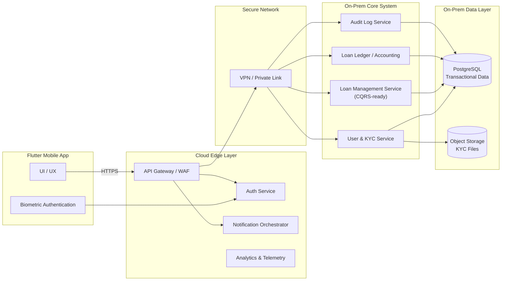

## 4. Arsitektur Sistem Tingkat Tinggi

Arsitektur sistem dirancang dengan tujuan utama untuk mendukung pengembangan MVP yang cepat, stabil, dan terkontrol, tanpa mengorbankan prinsip rekayasa perangkat lunak yang baik. Desain ini menempatkan fondasi yang jelas sejak awal agar sistem tetap mudah dikembangkan, minim risiko regresi, dan tidak menimbulkan tumpang tindih logika ketika terjadi penambahan fitur atau perubahan kebutuhan di kemudian hari.

Pendekatan yang digunakan adalah arsitektur _hybrid_, dengan memanfaatkan kemampuan cloud untuk kebutuhan *edge* dan non-core, serta menjaga komponen inti dan data sensitif tetap berada pada lingkungan yang lebih terkontrol.

---

### 4.1 Prinsip Arsitektur

Perancangan arsitektur sistem ini didasarkan pada prinsip-prinsip berikut:

1. **Proven MVP-first & Rapid Development**
   Arsitektur dirancang agar memungkinkan pengembangan MVP secara cepat dan efisien, menggunakan komponen dan teknologi yang telah terbukti stabil, dengan risiko bug dan kompleksitas operasional yang rendah.

2. **Separation of Concerns**
   Setiap lapisan dan layanan memiliki tanggung jawab yang jelas, untuk mencegah pencampuran logika bisnis, logika integrasi, dan logika presentasi.

3. **System of Record berada di Core**
   Seluruh data transaksi, status pinjaman, dan audit log diperlakukan sebagai *single source of truth* dan dikelola pada lapisan core system.

4. **Security & Data Sensitivity by Design**
   Data sensitif seperti identitas pengguna, dokumen KYC, dan data transaksi tidak dipaparkan langsung ke lapisan publik, serta dipisahkan dari layanan non-kritis.

5. **Maintainability & Change Readiness**
   Backend dirancang dengan prinsip SOLID dan memungkinkan penerapan pola seperti CQRS untuk meminimalkan dampak perubahan terhadap kode yang sudah ada.

---

### 4.2 Gambaran Arsitektur Hybrid

Arsitektur sistem dibagi ke dalam dua domain utama:

* **Cloud Edge Layer**
  Digunakan untuk menangani kebutuhan yang bersifat:

  * publik,
  * elastis,
  * berorientasi distribusi dan proteksi,
    seperti API gateway, autentikasi pengguna, notifikasi, dan analitik.

* **On-Prem Core System**
  Digunakan untuk mengelola:

  * proses bisnis inti,
  * data transaksi,
  * data KYC,
  * dan audit log,
    dengan kontrol penuh terhadap keamanan, konsistensi, dan integritas data.

Kedua domain ini dihubungkan melalui koneksi yang aman menggunakan **VPN atau private link**, untuk memastikan komunikasi data berlangsung secara terenkripsi dan terbatas.

---

### 4.3 Diagram Arsitektur Tingkat Tinggi

---

### 4.4 Penjelasan Komponen Utama

**Flutter Mobile Application**
Berfungsi sebagai antarmuka pengguna. Autentikasi biometrik dilakukan di sisi perangkat dan dikaitkan dengan mekanisme token di backend.

**Cloud Edge Layer**
Menjadi lapisan pelindung dan orkestrator awal, mencakup:

* API Gateway dan WAF untuk proteksi dan kontrol trafik.
* Layanan autentikasi terkelola untuk mempercepat pengembangan MVP.
* Orkestrasi notifikasi (email, SMS, push notification).
* Pengumpulan data analitik berbasis event non-PII.

**On-Prem Core System**
Menjadi pusat logika bisnis dan data, mencakup:

* Pengelolaan pengguna dan status KYC.
* Manajemen pinjaman dengan kontrol status dan validasi aturan bisnis.
* Pencatatan ledger pinjaman sebagai dasar akuntabilitas.
* Audit log bersifat *append-only* untuk kebutuhan pelacakan dan kepatuhan.

**Data Layer**

* **PostgreSQL** digunakan untuk data transaksi dan status yang membutuhkan konsistensi tinggi.
* **Object storage** digunakan untuk penyimpanan dokumen KYC dan foto pengguna, terpisah dari data operasional.

---

### 4.5 Usulan Tech Stack (Opsional)

Usulan teknologi berikut disesuaikan dengan prinsip MVP-first dan kemudahan pengembangan:

* **Mobile App**: Flutter
* **API Gateway / WAF**: Cloud-managed gateway
* **Authentication**:

  * MVP: Supabase Auth (managed)
  * Enterprise/regulated: Keycloak (self-hosted)
* **Backend Core**: Service-oriented backend dengan penerapan SOLID dan kesiapan CQRS
* **Database**: PostgreSQL
* **Object Storage**: S3-compatible (on-prem)
* **Notification**: Email provider, SMS gateway, FCM/APNs
* **Observability**: Centralized logging dan basic telemetry

Pemilihan teknologi ini bersifat usulan dan dapat disesuaikan dengan kebijakan organisasi serta regulasi yang berlaku.

---

## 4.6 Notification Architecture (Email/SMS/Push)

Notifikasi adalah komponen lintas proses (*cross-cutting concern*) yang berperan penting dalam pengalaman pengguna dan operasional bisnis, khususnya untuk event krusial seperti persetujuan pinjaman. Arsitektur notifikasi dirancang dengan prinsip **reliability-first**, **data minimization**, dan **clear boundary** antara sistem inti dan pihak ketiga (provider).

### 4.6.1 Tujuan dan Prinsip

1. **Reliability untuk Event Kritis**
   Notifikasi untuk event penting (misalnya *Loan Approved*) harus memiliki peluang gagal yang minimal, serta memiliki mekanisme retry dan pelacakan status pengiriman.

2. **Data Minimization & Security**
   Kanal notifikasi (email, SMS, push) tidak boleh menjadi jalur kebocoran data sensitif. Payload notifikasi harus seminimal mungkin dan menghindari PII yang tidak diperlukan.

3. **Decoupling Provider**
   Sistem tidak bergantung pada satu vendor/provider. Integrasi dibuat melalui adapter/provider interface agar mudah diganti.

4. **Idempotency dan Anti-Duplicate**
   Setiap event notifikasi harus memiliki identitas yang jelas agar tidak terjadi pengiriman ganda akibat retry dari sistem, gangguan jaringan, atau pemrosesan ulang.

5. **Auditability**
   Setiap attempt pengiriman harus tercatat (event, kanal, waktu, hasil) untuk kebutuhan investigasi insiden dan kepatuhan.

### 4.6.2 Klasifikasi Kanal dan Kebijakan Penggunaan

Sistem mendukung tiga kanal notifikasi:

* **Email (Transactional Email)**
  Kanal utama untuk komunikasi resmi dan arsip yang mudah ditelusuri.

* **SMS (atau Messaging Gateway)**
  Kanal yang kuat untuk memastikan pesan penting tersampaikan meskipun user jarang membuka email.
  Catatan: pada tahap MVP, SMS dipilih sebagai baseline universal; kanal lain seperti WhatsApp dapat menjadi opsi lanjutan.

* **Push Notification (FCM/APNs)**
  Kanal pendukung untuk meningkatkan UX (real-time feedback) dan mendorong engagement.
  Push tidak digunakan untuk menyampaikan data sensitif; hanya sinyal singkat yang mendorong user membuka aplikasi.

**Policy default untuk event kritis (Loan Approved):**

* Sistem melakukan attempt pengiriman ke **Email dan SMS**.
* Push dapat dikirim sebagai tambahan, tergantung strategi produk dan readiness teknis pada MVP.

### 4.6.3 Komponen Arsitektur Notifikasi

Arsitektur notifikasi terdiri dari komponen berikut:

1. **Notification Orchestrator (Cloud Edge Layer)**
   Service yang bertanggung jawab untuk:

   * menerima trigger notifikasi dari core backend,
   * menentukan kanal yang digunakan (email/sms/push),
   * menyusun payload (template + variables),
   * melakukan dispatch ke provider adapter,
   * mencatat status pengiriman.

2. **Provider Adapter Layer**
   Lapisan integrasi ke pihak ketiga yang dipisahkan berdasarkan kanal:

   * Email Provider Adapter
   * SMS Gateway Adapter
   * Push Provider Adapter (FCM/APNs)

3. **Notification Store (Status & Attempt Log)** *(opsional untuk MVP, namun direkomendasikan)*
   Penyimpanan untuk mencatat:

   * event id,
   * kanal,
   * attempt count,
   * response provider,
   * final status (sent/failed),
     untuk mendukung retry dan audit operasional.

4. **Secure Connectivity ke On-Prem Core**
   Trigger notifikasi dari core dilakukan via private link/VPN agar tidak membuka core system ke internet.

### 4.6.4 High-Level Flow Notifikasi (Event Kritis: Loan Approved)

Berikut alur high-level saat pinjaman disetujui:

1. **On-Prem Core** melakukan transisi status pinjaman `IN_REVIEW → APPROVED`.
2. Core menulis audit log internal terkait perubahan status.
3. Core mengirim **notification trigger** ke Notification Orchestrator melalui jalur aman (VPN/Private Link).
4. Notification Orchestrator:

   * melakukan validasi event dan idempotency,
   * menyusun konten berdasarkan template,
   * mengirimkan notifikasi ke kanal Email dan SMS,
   * opsional: mengirim push notification.
5. Notification Orchestrator mencatat hasil attempt pengiriman (berhasil/gagal) beserta metadata yang relevan.

### 4.6.5 Data Minimization dan Konten Notifikasi

Untuk menjaga keamanan data pengguna:

* **Email/SMS** hanya mengandung informasi minimum yang diperlukan, misalnya:

  * status “pinjaman disetujui”,
  * instruksi untuk membuka aplikasi untuk detail.
* **Push Notification** tidak menyertakan informasi sensitif (tanpa nominal, tanpa identitas detail). Contoh pola pesan:

  * “Pengajuan Anda telah diproses. Buka aplikasi untuk detail.”

Konten detail seperti jumlah pinjaman, schedule, atau outstanding amount tetap diambil dari aplikasi melalui API yang aman.

### 4.6.6 Reliabilitas: Retry dan Anti-Duplicate (Target Design)

Pada tahap MVP, implementasi bisa sederhana (best-effort dengan retry terbatas). Namun desain sejak awal mempertimbangkan peningkatan reliabilitas melalui:

* **Idempotency Key** per event-kanal (misalnya kombinasi `event_id + channel`)
* **Retry Policy** (exponential backoff untuk kegagalan sementara)
* **Dead Letter Handling** untuk kegagalan permanen agar dapat ditindaklanjuti
* **Deduplication** untuk mencegah pengiriman ganda saat terjadi retry sistem

Detail implementasi retry dan queue akan dibahas lebih lanjut pada bagian desain API (Bagian 8) dan future considerations.

### 4.6.7 Auditability dan Observability

Untuk keperluan audit dan operasional, sistem minimal harus dapat menjawab:

* Notifikasi apa yang dikirim, kapan, melalui kanal apa?
* Berapa kali attempt dilakukan?
* Apakah provider mengembalikan sukses/gagal?
* Jika gagal, apa kategorinya (temporary/permanent)?

Pencatatan yang disarankan:

* audit log di core (status loan berubah),
* notification attempt log di orchestrator (delivery status).
