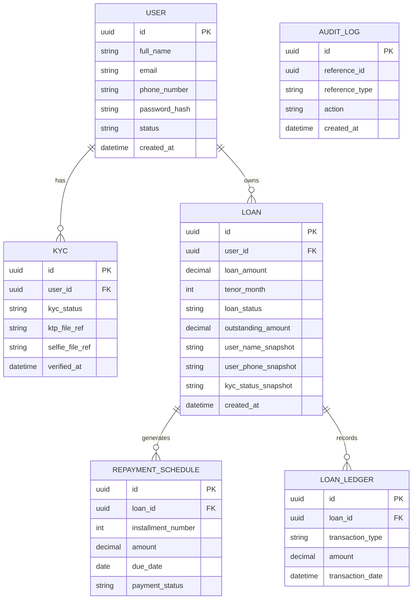

## 5. Model Domain & Entity Relationship Diagram (ERD)

Perancangan model data pada sistem ini bertujuan untuk menyeimbangkan antara **konsistensi data, performa baca (read performance), dan kemudahan evolusi sistem**. Pendekatan yang digunakan mengombinasikan **normalisasi untuk data inti** dan **denormalisasi terbatas** untuk mendukung kebutuhan pengalaman pengguna (UX) yang responsif.

### 5.1 Prinsip Desain Data

Prinsip utama dalam perancangan basis data adalah sebagai berikut:

1. **Normalized Core for System of Record**
   Data inti yang bersifat transaksional dan menentukan kebenaran sistem (*system of record*), seperti data pengguna, pinjaman, jadwal tagihan, dan ledger, dirancang dengan tingkat normalisasi yang memadai untuk menjaga konsistensi dan integritas data.

2. **Selective Denormalization for Read Optimization**
   Beberapa kolom dan atribut disimpan dalam bentuk *snapshot* atau denormalisasi terbatas untuk mempercepat proses pengambilan data pada halaman yang sering diakses pengguna, seperti dashboard dan ringkasan status pinjaman.
   Pendekatan ini dipilih karena sistem bersifat **read-heavy di sisi pengguna**, dan latensi baca memiliki dampak langsung terhadap kepuasan pengguna.

3. **Trade-off yang Disadari**
   Denormalisasi meningkatkan kompleksitas saat penyimpanan dan perubahan data, namun risiko tersebut diterima pada tahap MVP karena:

   * pengguna lebih toleran terhadap waktu simpan yang sedikit lebih lama dibanding waktu baca,
   * pembaruan snapshot dapat dilakukan secara sinkron dalam satu transaksi tanpa mekanisme asinkron tambahan.

4. **Ledger dan Audit Tetap Konsisten**
   Data ledger dan audit tidak didenormalisasi dan diperlakukan sebagai data yang bersifat append-only atau sangat terkontrol, untuk menjaga akuntabilitas dan keandalan data finansial.

5. **Evolusi Bertahap**
   Pendekatan yang digunakan memungkinkan pengembangan lanjutan ke arah:

   * read model terpisah,
   * materialized view,
   * atau mekanisme event-driven / asynchronous projection,
     tanpa mengubah struktur dasar data pada tahap MVP.

---

### 5.2 Entitas Utama dan Tanggung Jawabnya

**User**
Menyimpan data dasar pengguna dan status akun.
Beberapa atribut ringkas (misalnya nama lengkap dan nomor telepon) dapat digunakan sebagai referensi snapshot pada entitas lain untuk mempercepat query tampilan.

**KYC**
Menyimpan status verifikasi identitas pengguna serta metadata proses KYC.
Dokumen fisik seperti foto KTP dan foto pengguna disimpan pada object storage dan direferensikan melalui metadata.

**Loan**
Mewakili pinjaman pengguna dan status siklus hidupnya.
Entitas ini menyimpan:

* status pinjaman,
* nilai pinjaman,
* tenor,
* snapshot status KYC dan data pengguna yang relevan untuk kebutuhan tampilan cepat.

**Repayment Schedule**
Menyimpan jadwal tagihan bulanan per pinjaman.
Digunakan sebagai dasar perhitungan kewajiban pembayaran pengguna.

**Loan Ledger**
Mencatat transaksi finansial terkait pinjaman, seperti pencairan dan pembayaran.
Entitas ini bersifat historis dan tidak digunakan langsung untuk kebutuhan tampilan ringkas.

**Audit Log**
Mencatat aktivitas penting dan perubahan status untuk keperluan pelacakan dan kepatuhan.

---

### 5.3 Entity Relationship Diagram (ERD)

Diagram berikut menggambarkan relasi utama antar entitas pada sistem:

---

### 5.4 Constraint dan Pertimbangan Teknis

Beberapa aturan penting yang diterapkan pada tingkat data:

* **Single Active Loan Constraint**
  Pada tingkat aplikasi dan basis data, hanya diperbolehkan satu pinjaman dengan status *in-process* atau *active* per pengguna.

* **Indexing untuk Akses Cepat**
  Index disarankan pada kolom:

  * `user_id` dan `loan_status` pada tabel Loan,
  * `loan_id` pada tabel Repayment Schedule dan Loan Ledger,
    untuk mendukung query dashboard dan status pinjaman.

* **Snapshot Consistency**
  Kolom snapshot pada tabel Loan diperbarui secara sinkron ketika terjadi perubahan status penting (misalnya persetujuan pinjaman), sehingga konsistensi tetap terjaga tanpa mekanisme asinkron tambahan pada tahap MVP.
