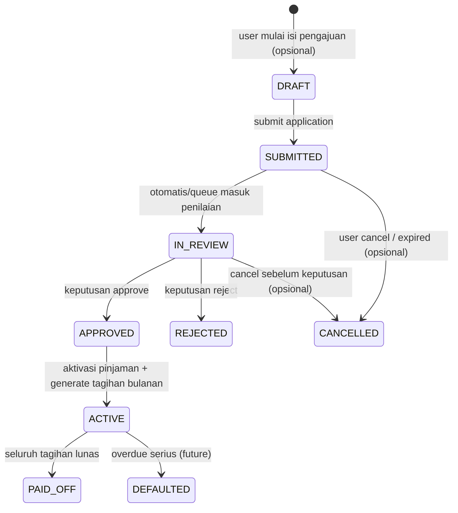

## 6. Loan Lifecycle & State Machine

Bagian ini mendefinisikan **siklus hidup pinjaman** sebagai *state machine* yang eksplisit, karena proses bisnis inti aplikasi berada pada perubahan status pinjaman—mulai dari pengajuan hingga penyelesaian. Definisi state yang jelas membantu mencegah kondisi tidak valid, memperjelas aturan *gating* “satu pinjaman aktif/dalam proses”, serta menjadi dasar untuk desain API, audit log, dan desain tampilan (screen behavior).

### 6.1 Tujuan dan Prinsip

1. **Konsistensi aturan bisnis utama**
   Sistem harus memblokir pengajuan pinjaman baru apabila pengguna masih memiliki pinjaman yang:

   * **dalam proses** (pengajuan belum diputuskan), atau
   * **aktif dan belum lunas**. 

2. **Traceability (audit-ready)**
   Setiap transisi status wajib dapat ditelusuri: siapa/apa yang memicu perubahan, kapan, dan alasan perubahan.

3. **Idempotency & concurrency-safe**
   Sistem harus menghindari duplikasi pengajuan akibat *double submit*, retry dari mobile network, atau race condition.

4. **Read-optimized view yang aman**
   Untuk kebutuhan UX (dashboard status dan tagihan bulanan), sistem boleh menggunakan snapshot/denormalisasi terbatas (lihat Bagian 5), namun sumber kebenaran status tetap dari *system of record*.

---

### 6.2 Definisi Status Pinjaman

Status pinjaman berikut dirancang untuk memenuhi requirement minimal (in process, accepted/rejected, unpaid) , namun tetap rasional dan umum digunakan pada implementasi industri:

* **DRAFT**
  Pengguna sedang mengisi pengajuan, belum dikirim. (Opsional secara UI; secara backend bisa disimpan atau tidak.)

* **SUBMITTED**
  Pengajuan telah dikirim oleh user dan masuk antrean proses penilaian.

* **IN_REVIEW**
  Pengajuan sedang diproses penilaian (otomatis/manual).
  *Catatan:* Untuk MVP, SUBMITTED dan IN_REVIEW dapat disatukan; namun pemisahan ini membantu audit dan debugging.

* **APPROVED**
  Pengajuan disetujui. Pada titik ini sistem wajib memicu notifikasi ke email dan nomor telepon terdaftar. 

* **REJECTED**
  Pengajuan ditolak.

* **ACTIVE**
  Pinjaman telah aktif dan memiliki kewajiban tagihan bulanan (schedule). Pengguna dapat melihat sisa hutang dan tagihan per bulan. 

* **PAID_OFF**
  Pinjaman lunas. Setelah ini user boleh mengajukan pinjaman lagi. 

* **CANCELLED** *(opsional, namun umum)*
  Pengajuan dibatalkan sebelum diputuskan (misal user menarik pengajuan atau timeout). Untuk MVP, bisa tidak diimplementasikan, tetapi status ini lazim pada sistem produksi.

* **DEFAULTED** *(opsional, future)*
  Menandai kredit macet; tidak dibutuhkan requirement awal, namun umum pada domain pinjaman.

---

### 6.3 Diagram State Machine (Mermaid)

---

### 6.4 Aturan Gating: “Satu Pinjaman Aktif / Dalam Proses”

Aturan bisnis inti yang wajib ditegakkan:

* User **dilarang** membuat pengajuan baru bila memiliki pinjaman dengan status:

  * `SUBMITTED` atau `IN_REVIEW` (masih proses), atau
  * `ACTIVE` (belum lunas). 

**Definisi “loan yang memblokir”:**

* `blocking_status ∈ {SUBMITTED, IN_REVIEW, ACTIVE}`

**Perilaku sistem saat user menekan “Ajukan Pinjaman”:**

1. Backend melakukan query: apakah ada `Loan` milik user dengan `blocking_status`?
2. Jika ada:

   * API mengembalikan error terstruktur (misalnya 409 Conflict) dengan payload yang menyertakan `current_loan_id` dan `current_loan_status` untuk ditampilkan pada UI.
3. Jika tidak ada:

   * sistem mengizinkan pembuatan pengajuan baru.

**Catatan implementasi penting (concurrency-safe):**

* Selain validasi di level aplikasi, disarankan ada proteksi di level DB untuk mencegah race condition (misalnya 2 request submit bersamaan). Bentuknya bisa berupa:

  * constraint berbasis kondisi (partial unique index) pada loan “aktif/dalam proses” per user (tergantung kapabilitas DB), atau
  * mekanisme locking/transaksi saat create SUBMITTED.

Tujuan: memastikan aturan  tidak bisa ditembus oleh kondisi jaringan atau retry.

---

### 6.5 Transisi Status dan Trigger

Berikut transisi status penting beserta trigger dan side effects (ini yang akan menjadi dasar desain API dan audit log):

1. **DRAFT → SUBMITTED**

   * Trigger: user menekan tombol submit.
   * Validasi:

     * user login valid (password/biometric token). 
     * nilai pinjaman ≤ 12.000.000 dan tenor ≤ 12 bulan. 
     * tidak ada pinjaman lain yang memblokir (lihat 6.4). 
     * KYC minimal tersedia (upload KTP & foto tercatat). 
   * Side effects:

     * buat record pengajuan
     * tulis audit log “LOAN_SUBMITTED”

2. **SUBMITTED → IN_REVIEW**

   * Trigger: sistem memulai proses penilaian (otomatis atau manual).
   * Side effects:

     * audit log “LOAN_REVIEW_STARTED”

3. **IN_REVIEW → APPROVED / REJECTED**

   * Trigger: keputusan penilaian.
   * Side effects APPROVED:

     * generate jadwal tagihan bulanan (repayment schedule)
     * set initial outstanding amount
     * audit log “LOAN_APPROVED”
     * enqueue notifikasi email + SMS/telepon 
   * Side effects REJECTED:

     * audit log “LOAN_REJECTED” + reason

4. **APPROVED → ACTIVE**

   * Trigger: aktivasi pinjaman (untuk MVP bisa otomatis segera setelah approved).
   * Side effects:

     * memastikan schedule sudah terbentuk
     * audit log “LOAN_ACTIVATED”
   * Catatan UX:

     * Pada ACTIVE, user dapat melihat sisa hutang & tagihan bulanan. 

5. **ACTIVE → PAID_OFF**

   * Trigger: seluruh tagihan lunas (pembayaran detail bisa future, tapi status harus ada).
   * Side effects:

     * audit log “LOAN_PAID_OFF”
     * membuka kembali akses pengajuan pinjaman baru. 

---

### 6.6 Data Consistency Note (Wajib sebagai Pengingat Tim)

Karena terdapat *selective denormalization* (snapshot kolom untuk read performance), maka perlu pengingat tegas:

1. **Sumber kebenaran status pinjaman adalah field `loan_status` pada record pinjaman (system of record)**, bukan kolom snapshot di entitas lain.
2. Kolom snapshot (misal `user_name_snapshot`, `kyc_status_snapshot`, `outstanding_amount`) harus diperlakukan sebagai:

   * *read optimization*, dan
   * diperbarui secara sinkron saat terjadi perubahan status penting (approve, aktivasi, pelunasan) untuk menghindari mismatch.
3. Jika pada tahap MVP ditemukan kebutuhan update yang makin kompleks, mekanisme peningkatan yang disarankan adalah:

   * read model terpisah / materialized view / event projection,
     bukan menambah snapshot secara ad-hoc tanpa kontrol.

Catatan ini sengaja ditulis eksplisit untuk mengurangi risiko bug akibat inkonsistensi data yang biasanya muncul saat sistem bertumbuh.

---

### 6.7 Kesesuaian dengan Praktik Umum Industri

Desain state machine di atas umum diterapkan pada sistem pinjaman/fintech karena:

* Memisahkan fase pengajuan dan fase pinjaman berjalan (aplikasi vs kontrak pinjaman).
* Menyediakan status minimal yang bisa diaudit.
* Mendukung rule “single active loan” yang sangat lazim untuk mitigasi risiko.
* Memungkinkan evolusi ke fitur lanjutan (cancellation, default) tanpa mematahkan fondasi MVP.
